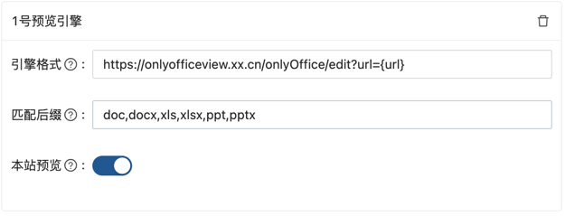

# 自定义预览引擎

蓝眼云盘`3.1.x`后的版本支持用户自定义预览引擎，你可以在网站偏好设置处，设置文件后缀所使用的预览引擎。

对于office文件，如果没有设置，那么会默认使用微软预览接口。 我们同样推荐使用kkfileview来预览。

## url占位符
- {originUrl} 文件原始的url地址。eg: https://tanker.eyeblue.cn/api/alien/download/2a0ceee1-744c-4c82-4215-69c382597a50/abstract-free-photo-2210x1473.jpg
- {url} 对于公有文件publicUrl=originUrl，对于私有文件publicUrl是originUrl带上downloadToken。 eg: https://tanker.eyeblue.cn/api/alien/download/2a0ceee1-744c-4c82-4215-69c382597a50/abstract-free-photo-2210x1473.jpg?downloadTokenUuid=6bdba52f-af6b-49ae-5a5d-fd80bfb01d3b
- {b64Url} 文件经过base64以及urlencode编码，即 b64Url = encodeURIComponent(Base64.encode(originUrl))


## 微软预览接口
蓝眼云盘中Office文件预览默认是使用微软提供的[预览接口](https://view.officeapps.live.com/op/embed.aspx)，因此预览有这几个限制。
- 1. 你部署的蓝眼云盘必须是公网ip或者外网可以访问的域名。(也就是或127.0.0.1或者localhost都不行)  
- 2. 文件不能太大，超过10M微软的预览接口便不支持了。


## kkfileview
https://kkfileview.keking.cn/zh-cn/index.html
支持多种预览格式。需要注意的是，如果你在docker中部署的kkfileview,需要保证docker中能够访问到你的蓝眼云盘(也就是说localhost可能访问不了)

### kkfileview 3.x.x 版本
引擎格式填写方式： http://your-kkfileview-domain/onlinePreview?url={b64Url}

### kkfileview 2.x.x 及以下版本
引擎格式填写方式： http://your-kkfileview-domain/onlinePreview?url={url}

## onlyOffice
1. 安装启动onlyoffice/documentserver服务。

因7.2版本后启动需配置JWT token，故这里选用7.1.1版本，预览功能类似，启动在9000端口。

```
docker run  -d -p 9000:80 --name onlyoffice-document-server onlyoffice/documentserver:7.1.1
```
启动后，验证下这个js是否存在，后续会用到：

```
curl http://localhost:9000/web-apps/apps/api/documents/api.js
```

2. 安装启动leaf-onlyoffice服务。[下载1.0版本jar包](https://github.com/cumany/leaf-onlyoffice/releases/tag/1.0)

启动leaf-onlyoffice，启动在9001端口。[查看1.0文档](https://github.com/cumany/leaf-onlyoffice/tree/1.0)

```java -jar leaf-onlyOffice.jar --server.port=9001 --only-office.doc-service={onlyoffice/documentserver服务启动地址}```

##### 上述命令中变量only-office.doc-service配置onlyoffice/documentserver服务启动地址说明，以下用ODS代指onlyoffice/documentserver服务:
##### - 如果场景只在局域网内部进行访问，则填上客户端可以访问到ODS服务的局域网地址。如ODS服务启动在局域网192.168.x.x:9000上，则填入192.168.x.x:9000，验证客户端是否可以访问到让客户端```curl http://192.168.x.x:9000/web-apps/apps/api/documents/api.js```
##### - 如果场景是在公网上进行访问，则填上客户端可以访问到ODS服务的公网地址。这里需要有公网域名以及服务器，假设我的域名是```xx.cn```，ODS服务启动在服务器上，先解析```onlyoffice.xx.cn```域名访问转发到ODS服务上，以nginx配置举例，这里也顺带配置了https:
```
        server {
                listen 80;
                server_name onlyoffice.xx.cn;
                return 301 https://$host$request_uri;
        }

        server {
                listen 443 ssl;
                server_name onlyoffice.xx.cn;

                # ssl证书相关，可通过acme.sh进行泛域名证书配置
                ssl_certificate /root/.acme.sh/xx.cn_ecc/fullchain.cer;
                ssl_certificate_key /root/.acme.sh/xx.cn_ecc/xx.cn.key;

                location / {
                        proxy_pass http://localhost:9000;
                        proxy_set_header Host $host;
                        proxy_set_header X-Real-IP $remote_addr;
                        proxy_set_header X-Forwarded-For $proxy_add_x_forwarded_for;
                        proxy_set_header X-Forwarded-Proto $scheme;

                        # 需配置ws协议头，否则建立ws链接报错
                        proxy_set_header Upgrade $http_upgrade;
                        proxy_set_header Connection "Upgrade";
                }
        }
```
##### 配置完毕后进行验证，通过浏览器访问 ```https://onlyoffice.xx.cn/web-apps/apps/api/documents/api.js```，然后启动leaf-onlyoffice命令里```only-office.doc-service```变量这里填入```https://onlyoffice.xx.cn```。

##### *如果你的蓝眼云盘是http访问的则nginx配置需要有一些裁剪，然后```only-office.doc-service```变量这里填入```http://onlyoffice.xx.cn```，具体可以问下deepseek。

3. 在蓝眼云盘-网站设置-预览引擎里配置上leaf-onlyoffice服务地址。

- 如果是局域网访问，则配置如下


- 如果是公网访问，则先解析```onlyofficeview.xx.cn```域名访问转发到leaf-onlyoffice服务上，以nginx配置举例：
```
        server {
                listen 80;
                server_name onlyofficeview.xx.cn;
                return 301 https://$host$request_uri;
        }

        server {
                listen 443 ssl;
                server_name onlyofficeview.xx.cn;
                ssl_certificate /root/.acme.sh/xx.cn_ecc/fullchain.cer;
                ssl_certificate_key /root/.acme.sh/xx.cn_ecc/xx.cn.key;

                location / {
                        proxy_pass http://localhost:9001;
                        proxy_set_header Host $host;
                        proxy_set_header X-Real-IP $remote_addr;
                        proxy_set_header X-Forwarded-For $proxy_add_x_forwarded_for;
                        proxy_set_header X-Forwarded-Proto $scheme;
                }
        }
```

然后在蓝眼云盘上配置上：



感谢由@cumany、@biuaxia 提供leaf-onlyoffice服务、@温文英承 提供配置方法。


